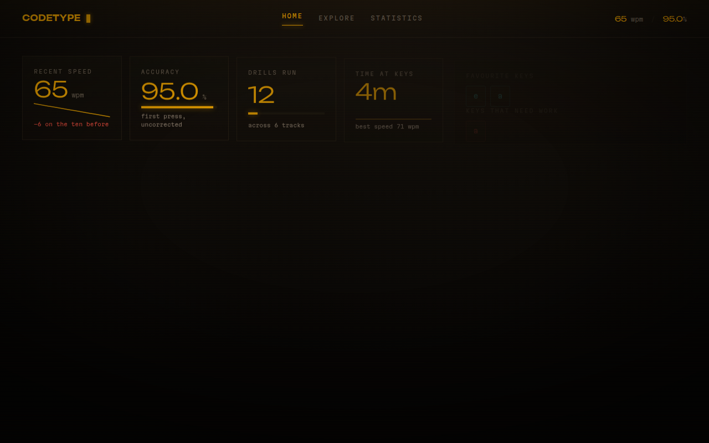
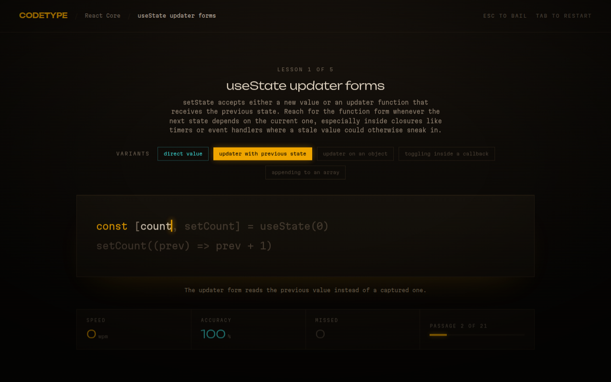

# CodeType

Typing practice that doubles as concept rehearsal.

You do not just get faster at hitting keys — you get faster at hitting *these*
keys, in *this* order, because that order is how `useOptimistic` is actually
written.




## The premise

Every lesson holds several **drills that say the same thing differently**: the
same hook at four call sites, the same utility type in four shapes. Typing
`useState` once is typing practice. Typing six different `useState` call sites
is a lesson — the repetition trains the fingers, and the *variation* is what
teaches you when the idea applies.

## Running it

```bash
npm install
npm run dev
```

| Script | Does |
| --- | --- |
| `npm run dev` | Vite dev server |
| `npm run build` | Typecheck, then a production build into `dist/` |
| `npm test` | Engine and catalogue tests |
| `npm run lint` | ESLint |
| `npm run check` | Lint, test and build — what CI runs |

## How it is put together

```
src/
  engine/      the typing core — pure, framework-free, heavily tested
  content/     the catalogue: schema plus authored tracks
  store/       localStorage progress and everything derived from it
  routes/      Home, Explore, Statistics, Drill
  components/  layout, the typing surface, cards, primitives
```

**The engine** compiles a passage into a flat stream of cells and runs every
keystroke through one reducer. Leading indentation is ghosted rather than typed,
so Enter lands the caret on the first real character of the next line. Typing is
forgiving: a wrong character is recorded and the cursor moves on, so a typo never
stalls you. Backspace lets you fix it — the correction shows up in `correctness`,
while the original mistake stays on the record in `accuracy`.

**Progress** is one versioned `localStorage` document. Everything on Home and
Statistics is derived from the list of completed sessions, so there are no
denormalised counters to drift. Each session carries its own keyboard ledger,
which is what makes the per-key breakdown real rather than estimated.

**The catalogue** is hand-authored TypeScript in `src/content/tracks/`. A
`course` is evergreen; a `dispatch` is something recent worth burning in while it
is still news. Both are the same shape, so nothing downstream special-cases them.

## Contributing

Write a track in `src/content/tracks/`, export it, and register it in
`src/content/index.ts`. `npm test` enforces the parts that are easy to get wrong:
unique ids, at least three drills per lesson, no duplicate passages inside a
lesson, no tabs or trailing whitespace, and a passage short enough to finish in
one sitting.

See [`CONTRIBUTING.md`](./CONTRIBUTING.md) for the full guide, including the
licence split below, and [`CLAUDE.md`](./CLAUDE.md) for the invariants worth
knowing before you touch the engine.

## Licence

Code is [MIT](./LICENSE). Lesson content in `src/content/` is
[CC-BY-SA-4.0](./src/content/LICENSE) — a deliberate difference, since the
catalogue is the commons this project exists to grow; see
[`docs/decisions/0003-licensing-split.md`](./docs/decisions/0003-licensing-split.md).
Third-party notices, including the OFL-1.1 fonts shipped in the built site,
are in [`THIRD-PARTY-NOTICES.md`](./THIRD-PARTY-NOTICES.md).

## Design

The visual direction is *phosphor terminal*: amber is the instrument, cyan means
you got it right and is used for nothing else, red means you did not, parchment is
content. Syntax colouring deliberately stays inside the amber family — a CRT never
had a rainbow, and the typing surface has to stay calm.

Canvas sources for the screen designs live in `design/`.

## Deploying

Static output in `dist/`. `netlify.toml` and `public/_redirects` are both
committed, so Netlify and Cloudflare Pages each work with no further setup —
build `npm run build`, publish `dist`.
